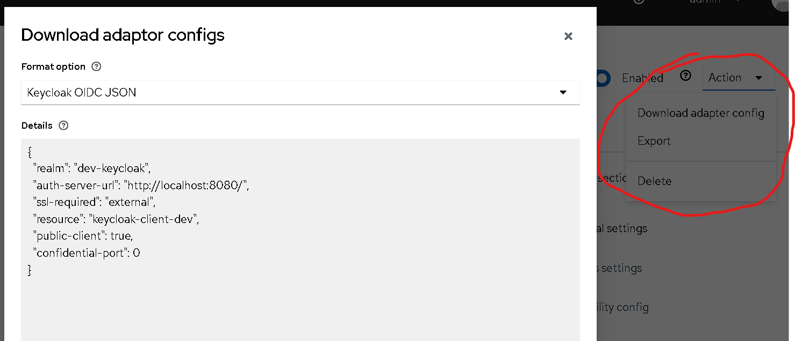
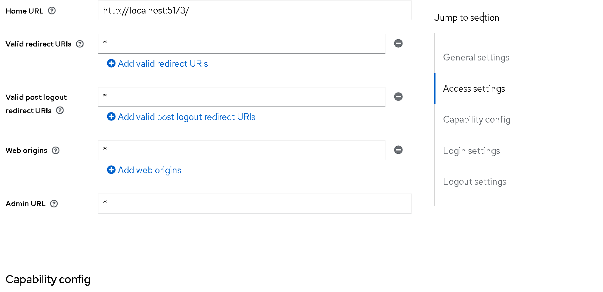
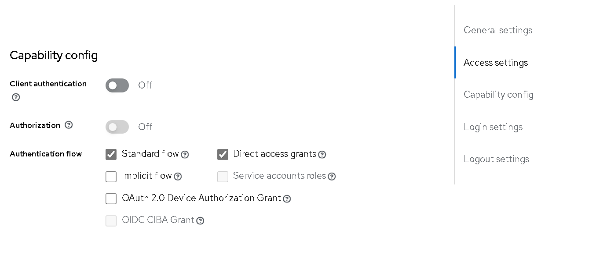

# Configuración de Keycloak

## Primeros Pasos

Comenzamos configurando nuestro Keycloak.

### Instalación

Instalamos keycloak-js con el siguiente comando:

npm install keycloak-js

### Configuración del Servidor

Luego configuramos nuestro servidor. Se recomienda ver el siguiente video:
[Video Tutorial](https://www.youtube.com/watch?v=NIo4LQH4wIA)

### Detalles de Configuración

Para más detalles, aquí tengo la siguiente configuración:




### Tercera Imagen

En esta tercera foto, presta atención:



### Login Propio

En caso de que requiera usar un login propio, deberá activar la autenticación del cliente y servicio por roles. Esta es otra configuración. Lo demás lo dejamos como está predeterminado.

### Creación de Usuarios

Ahora lo único que tienes que hacer es crear usuarios y jugar.

## Configuración del Código

Para finalmente tocar código y configurar nuestro servidor de la siguiente manera, ve a nuestro `clientId` y podrás ver nuestras configuraciones del cliente como en la siguiente imagen:


### Ejemplo de Configuración en JavaScript

```javascript
const keycloakConfig = {
    url: 'http://localhost:8080/', // Ejemplo: 'http://tuServidorKeycloak.com'
    realm: 'dev-keycloak',
    clientId: 'keycloak-client-dev',
}

keycloak
    .init({ onLoad: 'login-required' })
    .then((auth) => {
        if (!auth) {
            console.log('Not Authenticated')
            window.location.reload()
        } else {
            console.log('Authenticated')
            new Vue({
                // tu configuración de Vue
            }).$mount('#app')
        }
    })
    .catch(() => {
        console.error('Authentication Failed')
    })
```
